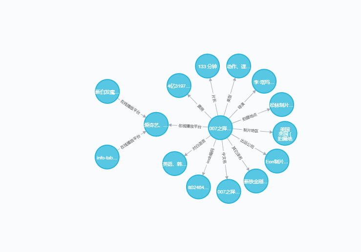

### 环境

- python 3.7
- requests:网络请求
- re:url正则匹配
- bs4:网页解析
- pickle:进度保存
- threading:多线程
- neo4j:知识图谱图数据库,安装可以参考
- pip install neo4j-driver：neo4j python驱动

### 代码目錄

- spider/ 抓取原始网页
- ie/ 从网页中解析正文，从正文中抽取结构化信息
- kg/ 抽取三元組，存入neo4j数据库

### 代码执行顺序：

- 1.spider目录下执行：python spider_main.py
- 2.ie目录下执行：python extract-table.py
- 3.kg目录下执行：python build-triple-from-table.py
- 4.kg目录下执行：python insert_to_neo4j.py

### 知识图谱效果图

